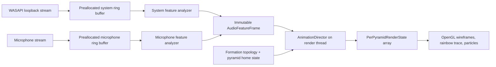

# Rainbow Starburst Audio-Reactive Roadmap

## Purpose

Rainbow Starburst should become a local, low-latency instrument that turns any sound on the computer into intentional motion across individually addressable pyramids. It must work with:

- system output from a show, film, game, browser, music player, or voice-chat application;
- a selected microphone;
- system output and microphone at the same time;
- silence, device changes, and unavailable audio hardware without destabilizing the visualization.

This is an implementation plan, not a loose idea list. It defines the common architecture first, then specifies each creative program in terms of inputs, pyramid mapping, algorithms, controls, failure behavior, tests, and completion criteria.

## Product principles

1. **Every pyramid is an instrument.** Programs should use individual pyramid position, adjacency, normal, scale, apex extension, brightness, phase, and particle emission—not merely scale the whole model from one volume meter.
2. **The original visual contract remains recognizable.** Resting wireframes stay white. Rainbow color belongs to moving signal paths and deliberate reactive accents rather than permanently assigning a random color to every pyramid.
3. **Audio never mutates physical home coordinates.** Reactive motion is a transient render layer, like the repaired wave offset. Returning to silence must return every pyramid precisely to its authored formation.
4. **The experience reacts to perception, not raw amplitude.** Adaptive noise floors, attack/release smoothing, logarithmic bands, onset detection, and bounded output ranges make a quiet conversation and a loud game equally expressive.
5. **Capture is local and private.** Raw samples are analyzed in memory and discarded. Recording, transcription, networking, and speech recognition are out of scope unless added later as separate, explicit opt-in features.
6. **Programs compose through one modulation system.** No mode writes directly into arbitrary physics fields. Each mode produces bounded channels that the animation director resolves consistently.

## Supported audio sources

### System output

Use Windows WASAPI loopback in shared mode. WASAPI loopback captures the mix being played by a render endpoint even when the hardware has no dedicated “Stereo Mix” input. PyAudioWPatch exposes WASAPI loopback endpoints as input devices and provides helpers for finding the default speaker loopback device.

Default behavior:

- follow the default Windows output device;
- offer explicit output-device selection;
- reopen the stream after a default-device change;
- show `SYSTEM: UNAVAILABLE` instead of failing the render loop;
- analyze only; do not write a WAV file.

### Microphone

Open the selected capture endpoint as a second stream. Keep its gain normalization and noise floor independent from system output. This prevents loud speakers from burying a quiet microphone and enables programs that distinguish the two participants in a chat.

Default behavior:

- microphone source is off until selected;
- remember the device identifier, not just its display name;
- apply a conservative noise gate with hysteresis;
- do not request exclusive access;
- expose a clear live/muted indicator.

### Both sources

Do not mix microphone and system PCM buffers. Devices can have different clocks, sample rates, channel counts, and latencies. Analyze each source independently and combine their normalized feature frames inside the animation program.

This also gives the visualization two semantic lanes:

- `system`: the show, game, music, or remote participant;
- `microphone`: the local participant or room.

## Target technical architecture



### Thread boundaries

- PortAudio callbacks only copy samples into preallocated single-producer/single-consumer buffers and increment overrun counters.
- Analyzer workers read full windows, calculate features, and publish an immutable snapshot.
- The pyglet/OpenGL thread reads one snapshot at the beginning of each frame.
- Only the render thread updates animation state, controller state, pyglet objects, or OpenGL.
- A full audio queue drops the oldest analysis window; it never blocks a PortAudio callback.

### Proposed module layout

```text
rainbowstarburst/
  audio/
    __init__.py
    devices.py          # endpoint enumeration, defaults, hot-plug recovery
    capture.py          # PyAudioWPatch stream lifecycle
    ring_buffer.py      # bounded preallocated SPSC audio buffers
    features.py         # FFT bands, envelopes, flux, onset, stereo metrics
    normalization.py    # noise floor, AGC, attack/release, silence state
    engine.py           # source orchestration and feature snapshots
  animations/
    __init__.py
    base.py             # AudioAnimation protocol and parameter schema
    director.py         # mode lifecycle and modulation composition
    topology.py         # face normals, shared-edge graph, geodesic distances
    spectrum_crown.py
    beat_bloom.py
    conversation_orbit.py
    cinematic_weather.py
    game_radar.py
    signal_relay.py
    harmonic_aurora.py
  tests/
    fixtures/           # short generated signals only; no captured user audio
```

The repository can remain flat initially, but these packages should be introduced before audio modes accumulate in `pyramidGUI.py`.

### Core data contracts

```python
@dataclass(frozen=True)
class SourceFeatures:
    active: bool
    rms: float
    peak: float
    bands: tuple[float, ...]       # eight normalized log-frequency bands
    centroid: float                # normalized 0..1
    flux: float                    # positive spectral change
    onset: bool
    beat_phase: float              # 0..1, when confidence is sufficient
    tempo_bpm: float | None
    tempo_confidence: float
    stereo_balance: float          # -1 left, +1 right
    stereo_width: float            # 0 mono, 1 decorrelated/wide


@dataclass(frozen=True)
class AudioFeatureFrame:
    sequence: int
    monotonic_time: float
    system: SourceFeatures
    microphone: SourceFeatures
    capture_latency_ms: float
    dropped_windows: int


@dataclass
class PerPyramidRenderState:
    radial_offset: float = 0.0
    apex_scale: float = 1.0
    uniform_scale: float = 1.0
    rotation_offset: np.ndarray = field(default_factory=lambda: np.zeros(3))
    line_alpha: float = 1.0
    line_width: float = 1.0
    accent_mix: float = 0.0
    particle_rate: float = 0.0
```

Each formation also exposes immutable metadata:

- home path and home transform;
- outward normal;
- spherical latitude and azimuth;
- shared-edge neighbors;
- connected-component and geodesic distance caches;
- deterministic index and seeded variation value.

### Feature extraction baseline

Start at the device's native sample rate, normally 48 kHz. A 1,024-sample Hann window with a 512-sample hop gives approximately 21 ms of frequency context and an approximately 10.7 ms update cadence at 48 kHz.

The first implementation should use NumPy only:

1. remove DC and downmix analysis channels while retaining separate left/right energy;
2. multiply by a cached Hann window;
3. calculate `numpy.fft.rfft` magnitudes;
4. integrate eight logarithmic bands: 35–70, 70–140, 140–300, 300–700, 700–1,600, 1,600–3,500, 3,500–7,500, and 7,500–16,000 Hz;
5. calculate RMS, peak, centroid, positive spectral flux, stereo balance, and stereo width;
6. update rolling 10th/95th-percentile floors and ceilings;
7. normalize to 0–1, then apply per-feature attack/release smoothing;
8. detect onsets from adaptive spectral-flux thresholds with a refractory interval;
9. estimate pulse from onset intervals only after a stable confidence threshold is met.

SciPy `ShortTimeFFT` and `find_peaks` are optional upgrades after the NumPy baseline is profiled. Librosa is a reference for onset and beat behavior, not an initial real-time dependency.

### Latency and performance budget

| Stage | Target |
| --- | ---: |
| Capture buffer | 5–11 ms |
| Window/hop analysis delay | 11–22 ms |
| Feature publication | under 2 ms |
| Render pickup at 60 FPS | 0–17 ms |
| Expected motion response | 30–55 ms |
| Required p95 response | under 75 ms |

At 1,280 pyramids, topology, band assignments, and home transforms must be cached. Per-frame work should be vectorized over NumPy arrays. New Python objects must not be created per pyramid per frame.

## Shared animation grammar

All programs use the following channels so switching modes feels cohesive:

- **breath:** slow global or regional scale/radial motion;
- **strike:** a short onset-driven impulse;
- **travel:** an energy front moving over the adjacency graph;
- **tip:** per-pyramid apex extension;
- **signal:** the animated rainbow route;
- **spark:** bounded particle emission;
- **rest:** an exact return to authored home geometry.

The `AnimationDirector` owns these channels. A program emits target values, and the director applies clamping, attack/release, reduced-motion scaling, and return-to-rest behavior.

Recommended hard bounds:

- radial offset: ±35% of formation core radius;
- apex scale: 0.55–1.9;
- uniform scale: 0.82–1.22;
- rotation offset: ±18 degrees unless a mode explicitly owns global rotation;
- particle count: existing global cap of 2,000;
- silence return: within 1.5 seconds with no positional drift.

## Creative program 1: Spectrum Crown

### Experience

The joined Star behaves like a living spectral sculpture. Bass moves broad foundational regions; mids articulate the body; high frequencies dance over small clusters. It should read as one sound distributed across 80 precise mechanical elements, not as a conventional bar equalizer wrapped around a sphere.

### Audio mapping

- Assign every pyramid one primary and one secondary log-frequency band using its normal, latitude, and a deterministic golden-angle ordering.
- Low bands occupy broad polar caps with overlapping influence.
- Mid bands wind around the equator.
- High bands occupy smaller alternating clusters, making high-frequency detail visibly granular.
- Blend 75% primary-band energy and 25% neighboring-band energy to avoid hard seams.

### Per-pyramid motion

- `apex_scale = 0.8 + 0.9 * band_energy^1.35`
- `radial_offset = 0.16 * core_radius * smoothed_band_energy`
- local attack/release varies slightly by deterministic seed, within a 20 ms range;
- adjacent faces receive a 5% coupling term to keep bases visually cohesive.

### Color and particles

- Resting wireframes remain white.
- The rainbow signal route seeks the loudest neighboring band and changes hue according to spectral centroid.
- A high-confidence spectral-flux onset emits 2–12 particles from the currently dominant band cluster.

### Controls

- `BAND SPREAD`: narrow isolated clusters ↔ broad blended regions;
- `REACTIVITY`: envelope attack/release preset;
- `DEPTH`: apex/radial motion multiplier within safe bounds.

### Implementation steps

1. Cache frequency-band assignments in `animations/topology.py`.
2. Add vectorized band-to-pyramid influence matrix with shape `[pyramids, bands]`.
3. Implement target calculation without mutating home paths.
4. Route rainbow traversal through the maximum-energy adjacency path.
5. Add deterministic sine, dual-tone, and frequency-sweep tests.

### Acceptance criteria

- A 50 Hz sine moves only low-band regions after settling.
- A 4 kHz sine moves high-band clusters and not the polar bass region.
- A 50 Hz→12 kHz sweep visibly travels through the full formation in the documented order.
- Silence returns every render state to identity within 1.5 seconds.
- Changing formation recomputes assignment without index errors at 7, 20, 24, 80, 320, and 1,280 pyramids.

## Creative program 2: Beat Bloom

### Experience

Rhythm opens the Star like a mechanical flower. Kicks compress and release the whole core, snares throw a traveling ring across alternating faces, and hats make only the tips flicker. When no stable beat exists, the program remains onset-reactive instead of inventing a tempo.

### Audio mapping

- kick evidence: 35–140 Hz energy plus low-band spectral flux;
- snare evidence: 140–300 Hz body plus 1.6–7.5 kHz transient energy;
- hat evidence: 3.5–16 kHz transient energy with low bass contribution;
- beat phase: pulse-locked loop updated from accepted onsets;
- confidence falls quickly when inter-onset intervals become inconsistent.

### Per-pyramid motion

- Kick: one 180–260 ms global compression/bloom envelope.
- Snare: choose a deterministic seed face and propagate a geodesic ring one neighbor hop every 18–30 ms.
- Hat: alternate parity groups for a 40–80 ms apex-tip shimmer.
- Beat phase: apply a subtle continuous breath only when confidence exceeds 0.65.

### Color and particles

- The rainbow signal follows the snare ring.
- Kicks momentarily brighten shared base edges without recoloring the resting wireframe.
- Strong broadband onsets emit an outward particle shell with a per-onset cooldown.

### Controls

- `PULSE LOCK`: OFF / LOOSE / TIGHT;
- `BLOOM`: kick depth;
- `RIPPLE SPEED`: graph-hop duration.

### Implementation steps

1. Implement onset classification with confidence scores, not semantic labels.
2. Add a beat tracker based on recent onset intervals and phase correction.
3. Precompute all-pairs geodesic hop distances for formations up to 320 pyramids; use bounded breadth-first searches above that size.
4. Implement reusable attack/hold/release envelopes.
5. Verify behavior with generated kick, snare-like noise, hat-like noise, steady clicks, and arrhythmic impulses.

### Acceptance criteria

- Four-on-the-floor test audio locks within four beats and stays within ±40 ms phase error.
- Arrhythmic speech never leaves a stale high-confidence tempo running longer than two seconds.
- One onset launches one bounded ring; no frame-rate-dependent duplicate triggers occur.
- Bases remain joined throughout the full Star bloom.

## Creative program 3: Conversation Orbit

### Experience

For a call, stream, or in-person conversation, the Star becomes a two-sided social object. Computer audio occupies one hemisphere; the microphone occupies the opposite hemisphere. Turns illuminate and move toward the active speaker. Overlapping speech creates a bridge around the equator, while a clean handoff sends the rainbow signal from one side to the other.

This mode analyzes activity and voice-like energy only. It does not identify speakers, recognize words, transcribe, or store audio.

### Audio mapping

- System and microphone use independent noise floors and activity gates.
- Voice activity evidence combines RMS, 140–3,500 Hz energy ratio, spectral flatness proxy, and hang time.
- System source maps to normals with positive X; microphone maps to negative X.
- Each hemisphere retains a 15% contribution from the other source near the equator for visual continuity.

### Per-pyramid motion

- Active hemisphere tips extend toward its source direction.
- Quiet hemisphere relaxes but never disappears.
- A source transition launches a 350–700 ms rainbow handoff across the shortest adjacency path between hemisphere centroids.
- Simultaneous activity lifts equatorial pyramids and creates a slow orbital rotation proportional to combined energy.

### Color and particles

- Source identity uses motion first.
- System handoff starts at cool rainbow hues; microphone handoff starts at warm hues, both resolving into the full spectrum.
- Laughter-like or excited broadband activity may increase spark density, but the UI labels this only as `HIGH ACTIVITY`, never as inferred emotion.

### Controls

- source selectors for system and microphone endpoints;
- per-source sensitivity trim;
- `HANDOFF`: subtle ↔ theatrical;
- hard microphone mute on the console.

### Implementation steps

1. Support two simultaneous capture streams and independent analyzers.
2. Add hysteretic source-activity state: quiet, attack, active, release.
3. Partition any formation into two balanced connected regions.
4. Implement handoff events from state transitions.
5. Add synthetic alternating-speaker, overlap, fan-noise, and silence fixtures.

### Acceptance criteria

- Microphone activity never moves the system hemisphere more than its documented crossfade amount.
- Alternating sources produce exactly one handoff per turn.
- Continuous background fan noise settles below the activity threshold after calibration.
- Muting the microphone closes its stream and zeroes its features immediately.

## Creative program 4: Cinematic Weather

### Experience

This is the default program for television, film, ambient music, and mixed desktop audio. It avoids depending on a regular beat. The Star breathes with ambience, opens around dialogue-range energy, ripples with score changes, and throws a controlled shockwave on major impacts.

### Audio mapping

- 1.5-second integrated loudness proxy drives atmosphere.
- 140–3,500 Hz presence drives an equatorial opening.
- Sub-bass transient evidence drives impact shockwaves.
- Spectral centroid controls whether activity concentrates toward lower or upper latitudes.
- Stereo balance rotates the active weather front around the vertical axis.

### Per-pyramid motion

- Atmosphere: very slow ±6% radial breath.
- Presence: equatorial apex opening with 120 ms attack and 450 ms release.
- Impact: expanding spherical ring using geodesic distance from the lower-front seed region.
- Score swell: coherent 2–4 second elevation wave based on long-term energy slope.

### Color and particles

- The normal signal trace remains rainbow.
- Quiet scenes keep most wireframes white and calm.
- Major low-frequency impacts emit a sparse shock shell; cooldown prevents explosion-heavy scenes from saturating the particle cap.

### Controls

- `SCENE ENERGY`: quiet / balanced / dramatic;
- `DIALOGUE LIFT`: equatorial response amount;
- `IMPACT LIMIT`: maximum shock frequency.

### Implementation steps

1. Add short, medium, and long envelope time scales.
2. Implement energy-slope and low-transient detectors.
3. Map stereo balance to a smoothed azimuth target.
4. Reuse the graph ring from Beat Bloom with slower cinematic envelopes.
5. Test against generated ambience, speech-band noise, sine sweeps, isolated impacts, and dense repeated impacts.

### Acceptance criteria

- Quiet ambience produces visible but non-distracting motion.
- Dialogue-band fixtures open the equator without falsely triggering impact particles.
- Repeated impacts respect the configured cooldown and global particle cap.
- Mono input centers the weather front instead of jittering left/right.

## Creative program 5: Game Radar

### Experience

Fast game audio becomes a readable directional energy field. Left/right transients strike the corresponding side of the Star and travel inward; bass impacts push broad regions; bright transients create sharp local needles. This is an audio visualization, not a gameplay-assistance classifier.

### Audio mapping

- Stereo balance determines left/right origin azimuth.
- Stereo width determines how concentrated or broad the origin region is.
- Low transient confidence drives broad impact ripples.
- High transient confidence drives narrow needle strikes.
- Broadband flux drives a multi-band burst.

Stereo cannot reliably determine front/back position. The visual must present direction as a left/right energy bias unless a future multichannel backend provides additional channels.

### Per-pyramid motion

- Select an origin cap centered on the current stereo azimuth.
- Inject a strike into that cap, then propagate through shared-edge neighbors.
- Low strikes use broad radial displacement and long decay.
- High strikes use apex extension and short decay.
- Sustained engine/ambience energy becomes a low-amplitude background tremor, not repeated strikes.

### Color and particles

- Rainbow strike routes begin at the inferred side and fade along graph distance.
- Particle direction follows the average normal of the origin cap.
- Confidence controls opacity; ambiguous mono events remain centered.

### Controls

- `RADAR WIDTH`: narrow ↔ broad localization;
- `IMPACT`: low-frequency depth;
- `NEEDLE`: high-transient depth;
- `FOCUS`: foreground transients ↔ full mix.

### Implementation steps

1. Preserve stereo channels through capture and calculate balance/width.
2. Add frequency-conditioned transient confidence values.
3. Build azimuth-to-face lookup tables for every formation.
4. Reuse bounded graph propagation with mode-specific envelopes.
5. Test left-only, right-only, centered, anti-phase, and mono signals.

### Acceptance criteria

- Left-only impulses originate on the left region and right-only impulses on the right.
- Mono impulses remain centered.
- Sustained tones do not retrigger onset effects each frame.
- The UI never claims front/back or a specific game event from stereo evidence alone.

## Creative program 6: Signal Relay

### Experience

The Star becomes a physical network. Sound energy enters selected pyramids and propagates over the exact shared-edge graph as a damped wave. Individual faces exchange energy with their neighbors, producing interference, echoes, and converging rainbow routes that could not be achieved with a global scale animation.

This should be the signature “we control every pyramid” program.

### Audio mapping

- Each frequency band owns one deterministic injection node separated from the others by geodesic distance.
- Band energy injects displacement at its node.
- Onsets inject velocity, creating a traveling wave.
- System and microphone can use two different seed sets.

### Per-pyramid simulation

For each node `i`, keep displacement `u[i]` and velocity `v[i]`:

```text
acceleration[i] = coupling * Σ(u[j] - u[i]) - damping * v[i] + audio_input[i]
velocity[i]    += acceleration[i] * dt
displacement[i] += velocity[i] * dt
```

Use a fixed 120 Hz simulation step with an accumulator, a bounded number of catch-up steps, and stable coupling/damping presets. Convert displacement into apex scale and a smaller radial offset. Never integrate it into physical home position.

### Color and particles

- The rainbow route follows the steepest positive-energy neighbor from the strongest injection node.
- Constructive interference briefly increases white-line brightness.
- Only strong, isolated wave collisions emit particles.

### Controls

- `COUPLING`: independent tips ↔ rigid shell;
- `DAMPING`: long echoes ↔ tight response;
- `INJECTION`: audio force;
- `SOURCE SPLIT`: shared seeds ↔ separate system/microphone networks.

### Implementation steps

1. Build a compact adjacency list from shared base edges.
2. Implement the fixed-step damped wave simulation with vectorized arrays.
3. Add deterministic band seed selection.
4. Implement energy-route tracing with loop prevention.
5. Add conservation/stability tests with impulses, silence, variable render `dt`, and 1,280 nodes.

### Acceptance criteria

- An impulse visibly reaches graph neighbors in increasing hop order.
- The simulation returns below 1% displacement after the preset decay interval.
- Results remain equivalent within tolerance at 30, 60, and 144 render FPS.
- No NaN, unbounded amplitude, or home-position drift occurs during a ten-minute stress test.

## Creative program 7: Harmonic Aurora

### Experience

Tonal sound paints stable harmonic regions while noisy sound dissolves into roaming light. Notes and chords create recognizable constellations across the Star; pitch changes rotate the constellation instead of simply increasing movement.

### Audio mapping

- Estimate 12 pitch-class energies using harmonic summation over FFT bins.
- Map pitch classes clockwise around azimuth.
- Map octave energy from lower to upper latitude.
- Spectral flatness controls constellation coherence: tonal audio is localized, noisy audio is diffuse.
- Require confidence before showing a named pitch class in diagnostics; the visual itself can interpolate continuously.

### Per-pyramid motion

- Active pitch classes lift their azimuth sectors.
- Octave distribution shifts the lift vertically.
- Chords activate multiple connected arcs.
- Pitch changes send a smooth rainbow rotation along the shortest circular direction.

### Color and particles

- Hue follows pitch-class angle but resolves through the existing rainbow spectrum.
- Stable tones produce no particles by default.
- Note onsets can release a small spark at the sector centroid.

### Controls

- `TONAL FOCUS`: strict pitch confidence ↔ permissive color field;
- `HARMONICS`: fundamental-only ↔ overtone-rich;
- `GLIDE`: pitch transition smoothing.

### Implementation steps

1. Add harmonic-summation pitch-class features to the analyzer.
2. Validate against generated notes over multiple octaves and amplitudes.
3. Build pitch-class/latitude influence matrices.
4. Add chord and glissando fixtures.
5. Profile before considering a constant-Q or librosa-based optional backend.

### Acceptance criteria

- A4 and A5 activate the same azimuth family at different latitudes.
- Major-triad fixtures activate three stable sectors.
- White noise remains diffuse and does not report high pitch confidence.
- A continuous glissando rotates smoothly without snapping or flicker.

## Switchboard integration

Add an `AUDIO REACTIVE` bank without removing manual WAVE, SPIN, PULSE, and NONE.

### Primary controls

- source: OFF / SYSTEM / MIC / BOTH;
- program: CROWN / BLOOM / ORBIT / CINEMA / RADAR / RELAY / AURORA;
- reactivity: CALM / BALANCED / LIVE;
- sensitivity trim;
- reduced motion;
- device/status drawer.

### Required status feedback

- selected endpoint names;
- `LIVE ANALYSIS — NOT RECORDING` privacy copy;
- per-source level and activity indicators;
- loopback/microphone unavailable state;
- buffer overrun count when nonzero;
- measured analysis/render latency;
- active program and fallback state.

### Mode transitions

1. Fade the outgoing program's modulation weight to zero over 250 ms.
2. Reset its internal state.
3. Start the incoming program from identity render states.
4. Fade in over 250 ms.
5. Manual NONE always wins immediately and returns to authored geometry.

## Implementation sequence

### Milestone 1 — Capture foundation

- Add PyAudioWPatch as the Windows audio dependency.
- Enumerate input and WASAPI loopback endpoints.
- Implement start/stop/reconnect lifecycle and preallocated ring buffers.
- Publish RMS/peak-only feature frames.
- Add a diagnostic console command and simulated-source backend.

Exit gate: system output and microphone can run separately and together for 30 minutes with no callback exception, memory growth, or renderer stall.

### Milestone 2 — Feature engine

- Add FFT bands, centroid, flux, onset, stereo metrics, noise floors, AGC, and smoothing.
- Add deterministic generated-signal tests.
- Add feature telemetry overlay behind a debug flag.

Exit gate: every feature has a unit test and remains normalized under silence, quiet audio, clipping, and device-native sample rates.

### Milestone 3 — Per-pyramid render layer

- Separate immutable home geometry from transient render state.
- Generate face normals and adjacency metadata for every formation.
- Add `AnimationDirector`, program lifecycle, bounds, reduced motion, and identity reset.

Exit gate: ten minutes of synthetic modulation creates zero permanent position/rotation drift.

### Milestone 4 — First complete programs

Implement in this order:

1. Spectrum Crown — validates bands and influence matrices.
2. Cinematic Weather — validates multiscale envelopes and non-beat content.
3. Signal Relay — validates adjacency and individual-pyramid simulation.
4. Beat Bloom — adds robust onset/pulse behavior.
5. Conversation Orbit — adds dual-source semantics.
6. Game Radar — adds stereo localization.
7. Harmonic Aurora — adds pitch-class analysis.

Every program lands with its own synthetic fixtures, controls, fallback behavior, and acceptance checklist.

### Milestone 5 — Product hardening

- endpoint hot-plug and default-device changes;
- saved settings with safe defaults;
- UI accessibility and keyboard control;
- reduced-motion profile;
- 30/60/144 FPS determinism checks;
- long-run memory/latency telemetry;
- packaging and clean-install verification on Windows 10 and Windows 11.

## Pull-request decomposition

Keep implementation reviewable with this dependency order:

1. `audio: add device enumeration and simulated source`
2. `audio: add WASAPI loopback and microphone capture`
3. `audio: add normalized realtime feature engine`
4. `animation: add immutable per-pyramid render state`
5. `animation: add formation topology and adjacency cache`
6. `ui: add audio source controls and privacy status`
7. `animation: add Spectrum Crown`
8. `animation: add Cinematic Weather`
9. `animation: add Signal Relay`
10. `animation: add Beat Bloom`
11. `animation: add Conversation Orbit`
12. `animation: add Game Radar`
13. `animation: add Harmonic Aurora`
14. `quality: add hot-plug, performance, and long-run tests`

No creative program PR should bypass the common render layer or introduce its own capture thread.

## Test strategy

### Unit tests

- exact band response for generated sine waves;
- RMS/peak normalization and clipping;
- onset count and refractory behavior;
- beat phase and confidence decay;
- stereo balance/width;
- pitch-class confidence;
- topology adjacency, connectivity, and geodesic distances;
- render-state clamping and identity reset;
- fixed-step wave stability.

### Integration tests

- simulated system and microphone streams at different sample rates;
- stream start/stop and endpoint loss;
- queue overrun without callback blocking;
- switching source and program during active audio;
- switching formations at every supported pyramid count;
- manual animation ↔ audio program transitions;
- export synchronization remains independent from render modulation.

### Visual acceptance recordings

Record short test runs using generated audio only:

- bass-to-treble sweep for Spectrum Crown;
- steady beat then arrhythmic speech for Beat Bloom;
- alternating/overlapping sources for Conversation Orbit;
- ambience/dialogue/impact sequence for Cinematic Weather;
- left/center/right impulses for Game Radar;
- single impulse propagation for Signal Relay;
- chromatic scale and chord for Harmonic Aurora.

### Long-run checks

- 30 minutes with both real sources;
- ten minutes at Globe detail 3 (1,280 pyramids);
- repeated device disconnect/reconnect;
- silence for five minutes after high-energy input;
- memory, callback overruns, analysis latency, render FPS, and particle count logged.

## Definition of done for the audio-reactive system

The overall feature is complete only when:

- system output, microphone, and both-source modes work on supported Windows systems;
- no raw audio is saved or transmitted;
- every program uses the shared feature and modulation contracts;
- every program has deterministic synthetic tests and documented controls;
- silence returns all pyramids exactly to home state;
- source loss degrades to a visible safe state without closing either window;
- p95 reaction latency is under 75 ms on the reference machine;
- the 1,280-pyramid formation maintains the agreed minimum frame rate;
- switching formations still produces the exact managed pyramid-file count;
- a clean installation can launch, select an endpoint, and run every program using only documented steps.

## Primary technical references

- [Microsoft: WASAPI loopback recording](https://learn.microsoft.com/en-us/windows/win32/coreaudio/loopback-recording)
- [PyAudioWPatch repository and supported WASAPI helpers](https://github.com/s0d3s/PyAudioWPatch)
- [PyAudioWPatch loopback capture example](https://github.com/s0d3s/PyAudioWPatch/blob/master/examples/pawp_record_wasapi_loopback.py)
- [NumPy real FFT (`numpy.fft.rfft`)](https://numpy.org/doc/stable/reference/generated/numpy.fft.rfft.html)
- [SciPy `ShortTimeFFT`](https://docs.scipy.org/doc/scipy/reference/generated/scipy.signal.ShortTimeFFT.html)
- [SciPy peak finding](https://docs.scipy.org/doc/scipy/reference/generated/scipy.signal.find_peaks.html)
- [Librosa onset detection](https://librosa.org/doc/0.11.0/onset.html)
- [Librosa beat and tempo tools](https://librosa.org/doc/0.11.0/beat.html)
